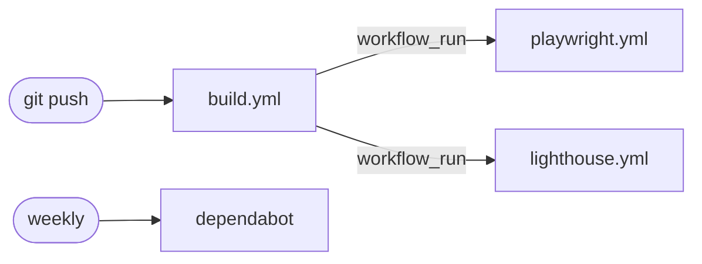

## The stack

- [Astro 6](https://astro.build) — pages
- [Tailwind 4](https://tailwindcss.com) — tokens, in a single `@theme` block in the global stylesheet
- [Pagefind](https://pagefind.app) — search index
- [Satori](https://github.com/vercel/satori) — OG images
- [GitHub Pages](https://pages.github.com) — host

Every tool in the chain produces a static artifact. There's no runtime data layer, no server, no client framework.
It's deliberately small, noanalytics, no tracking, no newsletter popup.

## The process

**Claude Design + [getdesign.md](https://getdesign.md/).** Pick a design system, drop it into Claude Design.

**[Claude Code](https://claude.com/claude-code) as the implementer.** Hand the bundle off to Claude Code as the spec. I describe an outcome using the superpowers brainstorming skill, refine, confirm the design & implementation plan.

**Skills carry the conventions.** For this use case:

- [obra/superpowers](https://github.com/obra/superpowers) — TDD, debugging, planning, brainstorming
- [web-design-guidelines](https://github.com/vercel-labs/agent-skills) — Vercel's web interface guidelines
- [accessibility](https://github.com/addyosmani/web-quality-skills) and [core-web-vitals](https://github.com/addyosmani/web-quality-skills) — from Addy Osmani's web-quality skills
- [tailwind-design-system](https://github.com/wshobson/agents) — token and component patterns

**LLMs and socials.** `/llms.txt` and the OG image route, both built at compile time, both shipped as static files.

I edited in [Zed](https://zed.dev) instead of the usual [VS Code](https://code.visualstudio.com). Frontmatter plugin isn't there yet, unfortunately.

## Continuous integration

CI runs [Playwright](https://playwright.dev), [axe-core](https://github.com/dequelabs/axe-core), [Lighthouse](https://github.com/GoogleChrome/lighthouse-ci), and [Dependabot](https://github.com/dependabot). Each catches a different class of regression: behavior, accessibility, performance, dependency drift.

**Playwright is the centerpiece.** Full e2e suite against a built site: responsive matrix, theme switching, view-transition pairing, the search box, the `/llms.txt` endpoint. The thing it catches that no static tool can is morph behavior — code that looks correct but renders broken.

**axe-core runs inside Playwright,** replacing `eslint-plugin-jsx-a11y`. The old rule could only see source. axe runs against the rendered DOM, where contrast, focus order, and missing landmarks actually live.

**Lighthouse runs through the LHCI GitHub App** for performance, accessibility (a second pass), best-practices, SEO. Budgets are configured per route.

**Dependabot runs weekly.** I review the PR, run the gates, and merge if it's green. Most updates are mechanical now; the work was paid up front.

Boundaries are clear, and either can be re-triggered with `workflow_dispatch` without rebuilding.

If needed i can use [act](https://github.com/nektos/act) to run them locally before pushing changes to the workflow files themselves.
